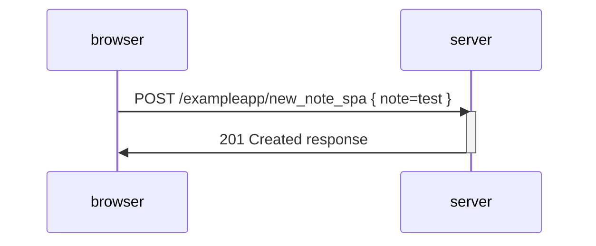

# User creates new note SPA flow

```mermaid
sequenceDiagram
    participant browser
    participant server

    browser->>server: POST /exampleapp/new_note_spa { note=test }
    activate server
    server->>browser: 201 Created response
    deactivate server

```
